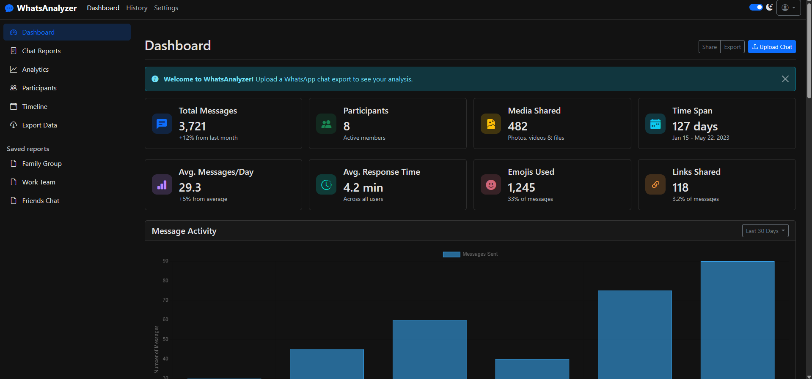

# 📱 WhatsAnalyzer


**WhatsAnalyzer** is a powerful Python web application built with Flask that turns your WhatsApp chat history into beautiful, interactive insights. Curious about who talks the most? Which emojis are your favorites? Or when your group is most active? WhatsAnalyzer cooks up the data for you! 🍳

> **Note:** This project is part of a personal coding challenge!

## ✨ Features

-   **📊 Comprehensive Statistics:** Visualize total messages, active days, and engagement metrics.
-   **👥 User Analysis:** See who dominates the conversation and who is the silent observer.
-   **😀 Emoji & Link Tracking:** Discover the most used emojis and shared links within your chats.
-   **📅 Temporal Trends:** Analyze activity over time (daily, monthly) to see how your conversations evolve.
-   **🔒 Secure & Private:** Authenticated access ensures your data remains private during the session. (Runs locally or self-hosted).
-   **📂 Easy Upload:** Simple drag-and-drop interface for WhatsApp `.txt` export files.

## 🚀 Tech Stack

-   **Backend:** Python, Flask
-   **Frontend:** HTML5, CSS3, JavaScript (Chart.js for visualizations)
-   **Processing:** Python Regex (`re`) for parsing raw chat logs.

## 🛠️ Installation & Setup

Follow these steps to get the kitchen running on your local machine:

### Prerequisites

-   Python 3.8 or higher

### 1. Clone the Repository

```bash
git clone https://github.com/Fvitu/WhatsAnalyzer
cd WhatsAnalyzer
```

### 2. Set up Virtual Environment

It's recommended to use a virtual environment.

```bash
# Windows
python -m venv venv
venv\Scripts\activate

# macOS/Linux
python3 -m venv venv
source venv/bin/activate
```

### 3. Install Dependencies

```bash
pip install -r requirements.txt
```

### 4. Run the Application

```bash
python app.py
```

Visit `http://localhost:5000` in your browser.

## 📖 How to Use

1.  **Export Chat:** Open a WhatsApp chat (Individual or Group) > Tap the three dots (⋮) > More > Export chat > Without Media.
2.  **Upload:** Upload the exported `.txt` file via the upload interface.
3.  **Explore:** View the generated dashboard with all your stats!

## 📸 Screenshots



## Environment (.env)

Create a minimal `.env` file in the project root with the essential settings required to run the app locally. Example:

```env
FLASK_ENV=development
SECRET_KEY=replace-with-strong-secret
MAX_CONTENT_LENGTH=10485760
ALLOWED_EXTENSIONS=txt
PORT=5000
LOG_LEVEL=INFO
```

Only `SECRET_KEY` is required for session and CSRF protection; adjust other values as needed.

## ⚠️ Disclaimer

This tool is intended for personal analysis of your own conversations. Always respect the privacy of the people you chat with. Exported chat files contain sensitive information — handle them with care.

## 🤝 Contributing

Contributions are welcome! If you have ideas for new metrics or improvements:

1.  Fork the repository.
2.  Create a new branch (`git checkout -b feature/AmazingFeature`).
3.  Commit your changes (`git commit -m 'Add some AmazingFeature'`).
4.  Push to the branch (`git push origin feature/AmazingFeature`).
5.  Open a Pull Request.

## 📄 License

This project is licensed under the MIT License - see the [LICENSE](LICENSE) file for details.

---

_Built by Fvitu with ❤️ and Python._
